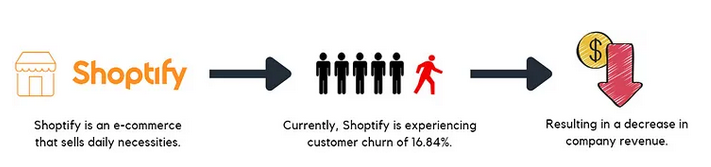

<br />
<p align="center">
  <a href="https://github.com/catiaspsilva/README-template">
    
  </a>

  <h3 align="center">README File</h3>
<!-- TABLE OF CONTENTS -->
<details open="open">
  <summary>Table of Contents</summary>
  <ol>
    <li>
      <a href="#about-the-project">About The Project</a>
    </li>
    <li>
      <a href="#getting-started">Getting Started</a>
      <ul>
        <li><a href="#dependencies">Dependencies</a></li>
        <li><a href="#installation">Installation</a></li>
      </ul>
    </li>
    <li><a href="#usage">Usage</a></li>
    <li><a href="#contributing">Contributing</a></li>
  </ol>
</details>


<!-- ABOUT THE PROJECT -->
## About The Project

# ecommerce_costumer_churn_prediction
Ceci est un ensemble de données d'une entreprise de commerce électronique.

Nous allons réalisé une analyse des clients qui se désabonnent du service de l'entreprise et créer créer un modèle de prédiction du désabonnement fiable.

### Features du dataset : 

- **CustomerID:** Identifiant unique du client
- **Churn:** Indicateur de désabonnement
- **Tenure:** Durée d'appartenance du client à l'organisation
- **PreferredLoginDevice:** Appareil de connexion préféré du client
- **CityTier:** Niveau de la ville
- **WarehouseToHome:** Distance entre l'entrepôt et le domicile du client
- **PreferredPaymentMode:** Mode de paiement préféré du client
- **Gender:** Genre du client
- **HourSpendOnApp:** Nombre d'heures passées sur l'application mobile ou le site web
- **NumberOfDeviceRegistered:** Nombre total d'appareils enregistrés pour un client particulier
- **PreferedOrderCat:** Catégorie de commande préférée du client le mois dernier
- **SatisfactionScore:** Score de satisfaction du client sur le service
- **MaritalStatus:** Situation matrimoniale du client
- **NumberOfAddress:** Nombre total d'adresses ajoutées pour un client particulier
- **OrderAmountHikeFromlastYear:** Pourcentage d'augmentation de la commande depuis l'année dernière
- **CouponUsed:** Nombre total de coupons utilisés le mois dernier
- **OrderCount:** Nombre total de commandes passées le mois dernier
- **DaySinceLastOrder:** Jours depuis la dernière commande du client
- **CashbackAmount:** Montant moyen de cashback le mois dernier

- **Objectif :**
  - Construire un modèle prédictif capable d'identifier avec précision les clients susceptibles de quitter l'entreprise (churn) en se basant sur les variables fournies. Cela peut aider l'entreprise à prendre des mesures proactives pour fidéliser ces clients et réduire le taux de churn.

<!-- GETTING STARTED -->
## Getting Started

1. Configuration de l'environnement Google Cloud :

    Assurez-vous d'avoir un compte Google Cloud et de créer un projet pour ce projet.
    Configurez les identifiants d'authentification appropriés pour accéder aux services Google Cloud.
    Activez les API nécessaires telles que BigQuery.

2. Stockage des données sur BigQuery :

    Importez le jeu de données dans BigQuery en créant une table adaptée.
    Assurez-vous que les données sont correctement structurées et prêtes pour l'analyse

### Dependencies

* Scikit-learn 0.24.2
  ```sh
  pip install scikit-learn==0.24.2
  ```
* Matplotlib 3.4.2
    ```sh
    pip install matplotlib==3.4.2
    ```
* Streamlit 1.15.0 
    ```sh
    pip install streamlit==1.15.0
    ```
* Joblib==1.0.1
    ```sh 
    pip install joblib==1.0.1
    ```

### Installation

1. Clone the repo
   ```sh
   git clone https://github.com/k-chanez/Churn-prediction.git
   ```

<!-- USAGE EXAMPLES -->
## Usage

1. Exécution du modèle :

    Lancez le script sur google colab, une fois le model est entrainé enregistré le mielleur model avec joblib.

2. Visualisation avec Streamlit :

    Pour lancer l'app streamlit : streamlit run APP_streamlit.py 

<!-- CONTRIBUTING -->
## Contributing
1. Fork the Project
2. Create your Feature Branch (`git checkout -b feature/AmazingFeature`)
3. Commit your Changes (`git commit -m 'Add some AmazingFeature'`)
4. Push to the Branch (`git push origin feature/AmazingFeature`)
5. Open a Pull Request

## Thank you
